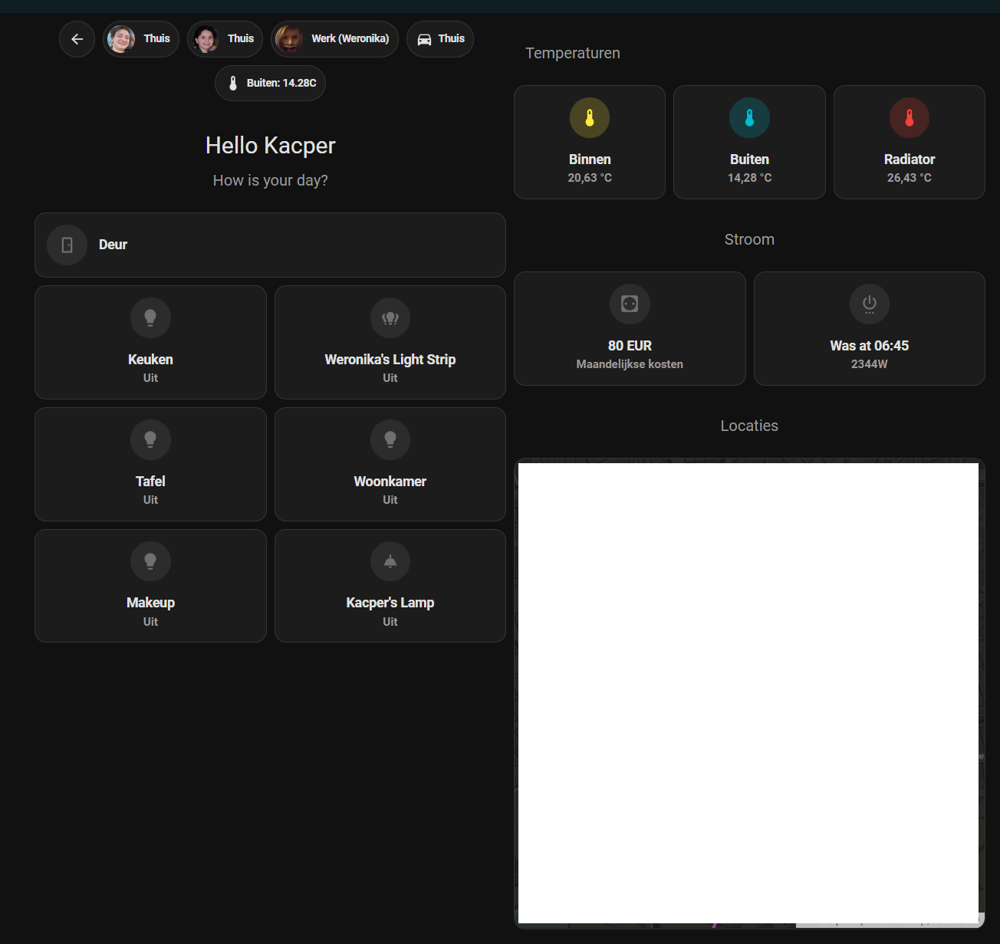

# hass-dashboard-generator

Generate YAML dashboard configuration file based on programmatic configuration.

Easily extendable to support more widgets.

## Installation

```bash
npm i
```

## Usage

```bash
npm run start
```

At every save, the whole configuration will be copied to the clipboard.

## Example dashboard


